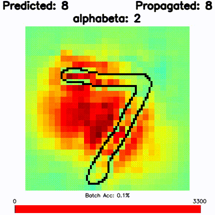
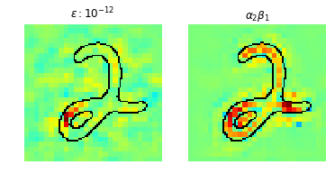
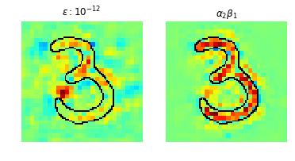
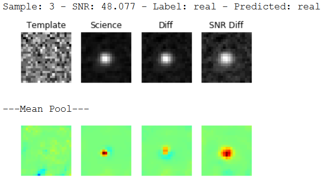

# Adaptation of LRP framework for Tensorflow

An adaptation to the Layer-wise Relevance Propagation (LRP) algorithm developed by **Lapuschkin et al., 2016** on their work **'The LRP Toolbox for Artificial Neural Networks' for the 'Journal of Machine Learning Research'**.

1. Original web page project: [heatmapping.org](http://heatmapping.org)
   
2. Original LRP toolbox repository for raw numpy can be found on [LRP-toolbox](https://github.com/sebastian-lapuschkin/lrp_toolbox)
3. Original LRP toolbox repository for Tensorflow can be found on [LRP-tensorflow](https://github.com/VigneshSrinivasan10/interprettensor)

The LRP algorithm projects a classifier's output to its input space, by attributing relevance scores to important features of the input. For example, if we have an image as the input of a classifier, output score of the model will be projected to the input image as a heatmap that identifies relevant pixels for the prediction made.

This Tensorflow adaptation of LRP provides an implementation of LRP for artificial neural networks (ANN). Specially Multi-Layer Perceptrons (MLP) and Convolutional Neural Networks (CNN) in the Deep Learning paradigm. 

The focus of this repository is to extend capabilities of the original LRP-tensorflow toolbox, by providing examples on various data sets, add relevance propagation through variations of implemented layers, and enable to reproduce results of paper **'Enhanced Rotational Invariant Convolutional Neural Network for Supernovae Detection'** by **Reyes et al., 2018**.

SUPERNOVAE VIDEO

### Requirements
    tensorflow >= 1.5.0
    python >= 3
    matplotlib >= 1.3.1
    scikit-image > 0.11.3
    jupyter notebook > 5.0.0
    
### What's new

1. Implementation of cyclic pooling layer, like in **'Exploiting cyclic symmetry in convolutional neural networks'** by **Dieleman et al., 2016**
2. Implementation of rotation layer, like in **'Deep-hits: Rotation invariant convolutional neural network for transient
detection'** by **Cabrera-Vives et al., 2017**
3. Implementation of Batchnormalization layer, although LRP relevance propagation is not fully tested.
4. LRP examples on HiTS 2013 dataset

## Usage

### 1. Model 

First you must instantiate a model, indicating the layers (modules) in the neural network to be in the form of a Sequence object. A quick way to define a network would be:

        net = sequential32.Sequential([convolution32.Convolution(kernel_size=5, output_depth=32, input_depth=1,
                                   input_dim=28, act ='relu',
                                   stride_size=1, pad='SAME'),
                       maxpool32.MaxPool(),

                       convolution32.Convolution(kernel_size=5,output_depth=64, stride_size=1,
                                   act ='relu', pad='SAME'),
                       maxpool32.MaxPool(),
                       
                       linear32.Linear(1024, act ='relu'),

                       linear32.Linear(10, act ='linear')])

        output = net.forward(input_data)

This way of defining the network provides a way to iteratively go through all network modules (layers) both in the forward pass and in the backward LRP propagation of relevance through the different layers.
             
### 2. Train the model

This `net` object can then be trained by calling the next method

        trainer = net.fit(output=score, ground_truth=y_, opt_params=learning_rate)
        
`trainer` is an optimizer that by default is defined as Adam with cross entropy. To modify this optimizer, see file `modules/train2.py` or implement your own. 

### 3. LRP - Layer-wise relevance propagation

Compute the relevances of the input pixels towards the prediction by

        relevances = net.lrp(output, lrp_rule, lrp_rule_param)

the different `lrp_rule` variants available are:

        'simple', 'epsilon','flat','ww' and 'alphabeta' 
        
but, we highly recommend usage of `epsilon` or `alphabeta` rules.

The resulting `relevances` is a variable with same dimensions as the input, and in case of a single-channel image, can be visualized as a heatmap. Like:

 

### 4. Get relevances of intermediate layers.  

Iterate through layers (modules) of `net` object and save relevances of every module.

       relevance_layerwise = []
       R = output
       for layer in net.modules[::-1]:
           R = net.lrp_layerwise(layer, R, lrp_rule, lrp_rule_param)
           relevance_layerwise.append(R)
           
           
## LRP for a pretrained model

To load a pretrained model you have two options:

### 1. Load Tensorflow checkpoint

Easiest way is to train a model under LRP framework, by following usage steps (1) and (2), saving a tensorflow checkpoint of the trained model:

       #initialize a saver object
       saver = tf.train.Saver()
       
       #TRAIN YOUR MODEL
       
       #after training save checkpoint by passing session and a path (CHECKPOINT_DIR)
       saver.save(session, CHECKPOINT_DIR)
       
Whenever you want to load your trained model, just call `saver.restore(sess, CHECKPOINT_DIR)` instead of               training a model. To perform LRP over this pretrained model, just follow usage step (3) or (4) as always.

### 2. Load numpy weights

Another way to load a pretrained model is to have weights and biases of every layer stored as an array in a `*.npy` file. For every layer, weights should be saved like `LAYER_NAME-W.npy` and biases like `LAYER_NAME-B.npy`. This parameters can be loaded to the model at usage step (1) by doing the following: 

      net = sequential32.Sequential([convolution32.Convolution(kernel_size=5, output_depth=32, input_depth=1,
                                         input_dim=28, act ='relu',
                                         stride_size=1, pad='SAME', param_dir=path_weights+'CNN1'),
                             maxpool32.MaxPool(),

                             convolution32.Convolution(kernel_size=5,output_depth=64, stride_size=1,
                                         act ='relu', pad='SAME', param_dir=path_weights+'CNN2'),
                             maxpool32.MaxPool(),

                             linear32.Linear(1024, act ='relu', param_dir=path_weights+'FC1'),

                             linear32.Linear(10, act ='linear', param_dir=path_weights+'FC2')])

where `path_weights` is the path to the folder were `*.npy` files of model parameters are stored, and the subsequent string (e.g. `CNN1`) is the corresponding layer name (e.g. first convolutional layer should have a weights file named `CNN1-W.npy` and a biases file named `CNN1-B.npy`).

Because of encapsulation of layers when using LRP framework to train, a list of weights and biases of every layer with parameters can be obtained by running:

      W,B = net.getWeights()
      weights, biases = sess.run([W,B])

## Examples

There are two examples on this repo; a basic MNIST example on the `examples/MNIST` folder that produces relevance heatmaps like:

and an example over de HiTS 2013 dataset on the `examples/Supernovae/paper` folder, that enables to replicate visualizations of the repo's paper with images like:

Each folder has a readme that explains instructions on how to run respective files, but the main idea is to have a notebook where the model will be trained to save its parameter, and another notebook to instantiate the trained model and run LRP through it. Each notebook contains comments that guide the execution of every block of code.

We recommend to start with the self-contained example of MNIST, to get an insight on how LRP works. 

## Extending LRP

Have in mind that for every layer of the model, there must be an LRP implementation (for every rule) that back propagates incoming relevances to the previous layer, this is often a complex operation and should be further studied for optimization.

As a recommendation, whenever you want to use a layer which is not implemented under de LRP framework try to take advantage of currently implemented layers and adapt them to your purpose. For example, to implement Batch Normalization Layer, we implemented the forward-pass like a convolutional operation, thus LRP back propagation of relevances could be reused from a convolutional layer. Another example is the cyclic pooling layer, which was implemented through an already existing average pooling layer.

## Misc

For further research and projects involving LRP, visit [heatmapping.org](http://heatmapping.org)

# WARNINGS

1. When running LRP over a large model or/and a large batch of images, take in account that the algorithm requires much more memory than a simple forward pass, so being able to perform a prediction with a certain model, won't guarantee that you will be able to perform LRP on it.  

2. After subsequent runs of LRP on a single instance, we registered a proportionally increasing amount of memory usage, this is attributed to a **memory leak** in the current implementation of the model. So be careful to not run out of memory when performing LRP iteratively over a large amount of data.

# Related Paper

[Our paper](http://jmlr.org/papers/volume17/15-618/15-618.pdf), cite by using:

      @inproceedings{reyes2017enhanced,
        title={Enhanced Rotational Invariant Convolutional Neural Network for Supernovae Detection},
        author={Reyes, Esteban and Est{\'e}ve, Pablo and Reyes, Ignacio and Cabrera-Vives, Guillermo and F{\"o}rster, Francisco ...},
        booktitle={Neural Networks (IJCNN), 2018 International Joint Conference on},
        pages={251--258},
        year={2018},
        organization={IEEE}
      }
